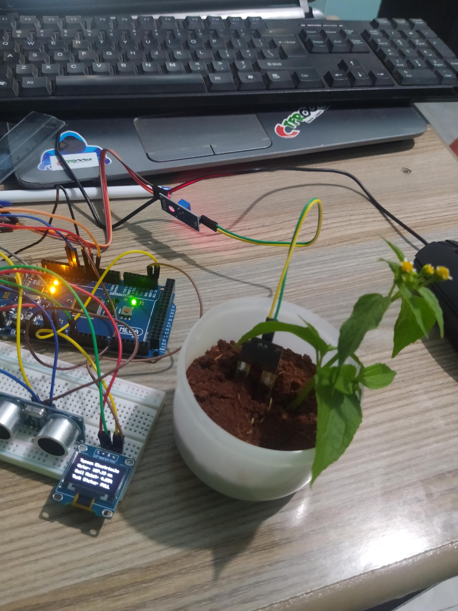
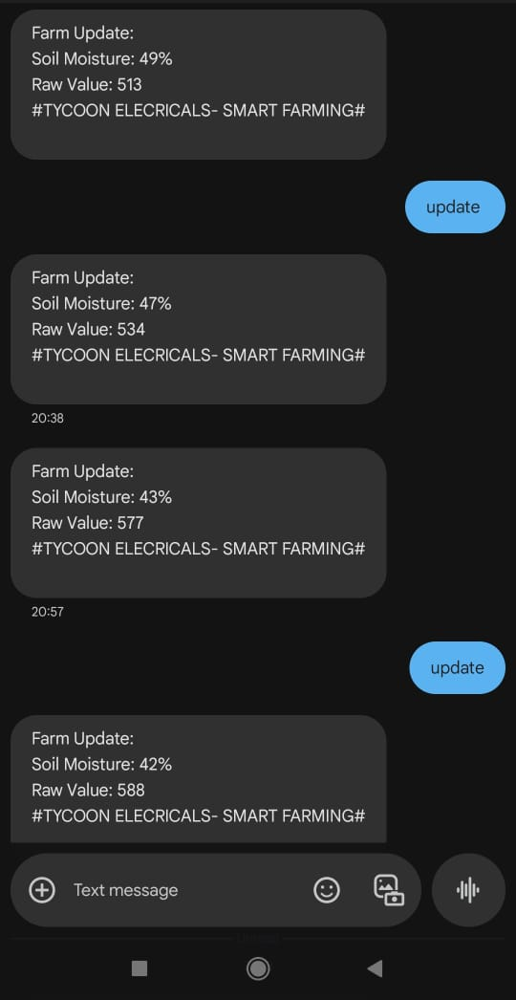
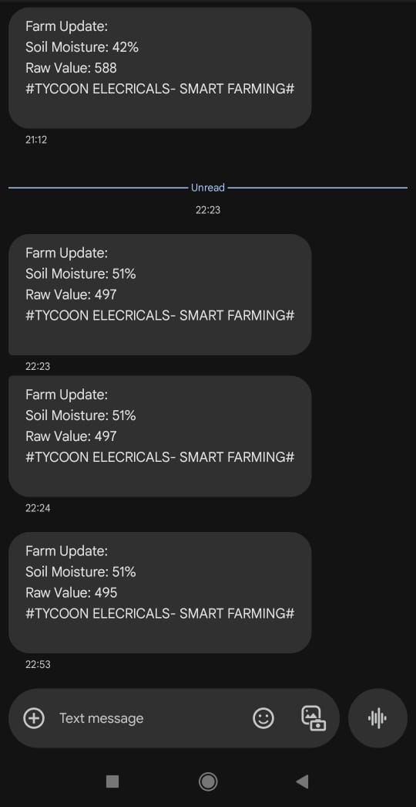
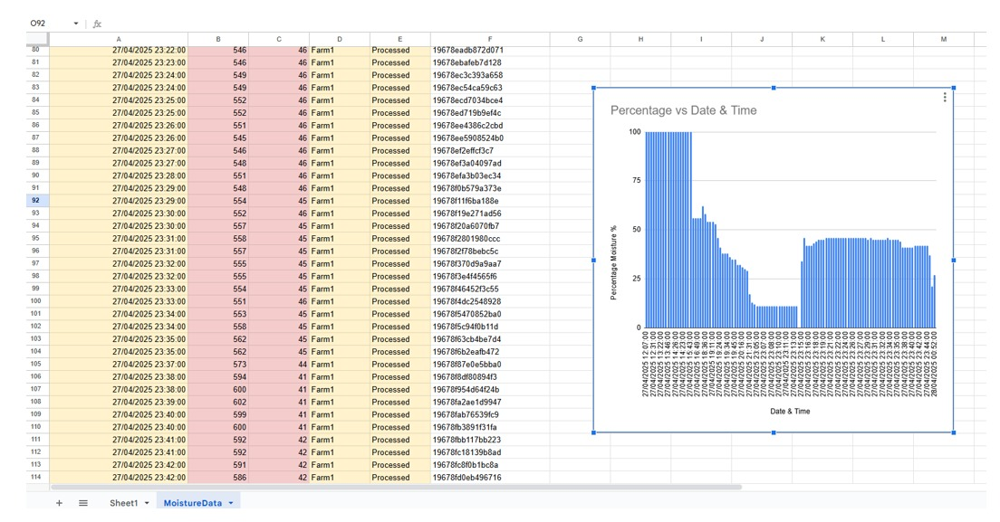

SmartFarm Monitoring System
GSM-based IoT soil moisture monitoring for precision agriculture.

Overview
SmartFarm is a low-cost, field-ready IoT system designed to monitor soil moisture and provide real-time updates to farmers via SMS. Built for reliability in remote areas, the system automates data collection and eliminates the need for manual field checks.
It supports both scheduled alerts and on-demand queries, helping smallholder farmers make timely irrigation decisions. All moisture readings are recorded in both raw and percentage formats.

Key Features
GSM-based soil moisture monitoring using SIM800L
Automatic SMS alerts every 30 minutes
Manual updates triggered by SMS keyword (e.g., “Moisture”)
Moisture readings provided as raw ADC and percentage
Filters non-Kenyan phone numbers for basic access control
Real-time serial debug output for diagnostics
hhhhh
Hardware Components
Component	Description
Arduino Mega	Main microcontroller
SIM800L Module	GSM communication
Analog Soil Sensor	Resistive moisture sensor
12V Battery Supply	System power
16x2 LCD (optional)	For local display (debug/info)

Software Details
Written in C++ using Arduino IDE
Uses SoftwareSerial for SIM800L communication

Modular functions for:
Sensor reading and moisture conversion
SMS sending and response handling
Scheduled 30-minute task execution
Basic number filtering for security

Setup Instructions
Connect components according to the schematic (to be added in docs/)
Upload the firmware from src/ using Arduino IDE
Insert a SIM card (PIN disabled) into the GSM module
Power on the system and observe serial output for logs
Send an SMS with the word “Moisture” to trigger a manual update

Development Status
Phase 1 Goals Achieved:
Stable soil moisture sensing
Accurate percentage conversion
Reliable SMS communication with SIM800L
Keyword command parsing (“Moisture”)
Number filtering for Kenyan +254 format

           

Documentation (coming soon)
Technical Manual
Schematic Diagram 

License
This project is licensed under the MIT License.
See the LICENSE file for details.

Maintained by Ephraim Mwangi — 2025
